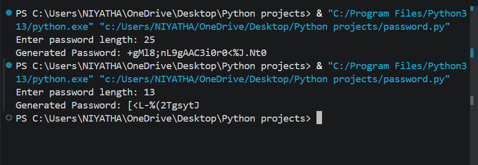

# Password Generator Tool

## Problem Statement

Develop a Python program to generate strong and secure random passwords.

## Features

* Generate random passwords
* User-defined password length
* Includes letters, numbers, and special characters
* Simple and easy-to-use interface

---

## Technologies Used

* Python
* `random` module
* `string` module

---

## How to Run

1. Open VS Code or any Python IDE
2. Create a file `password_generator.py`
3. Paste the code
4. Run using:

   ```
   python password_generator.py
   ```

---

## Output Screenshots

<div align="center">



<br><br>

</div>

---
